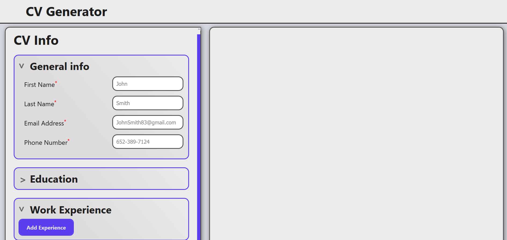
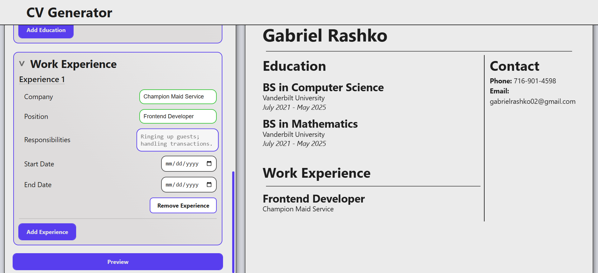
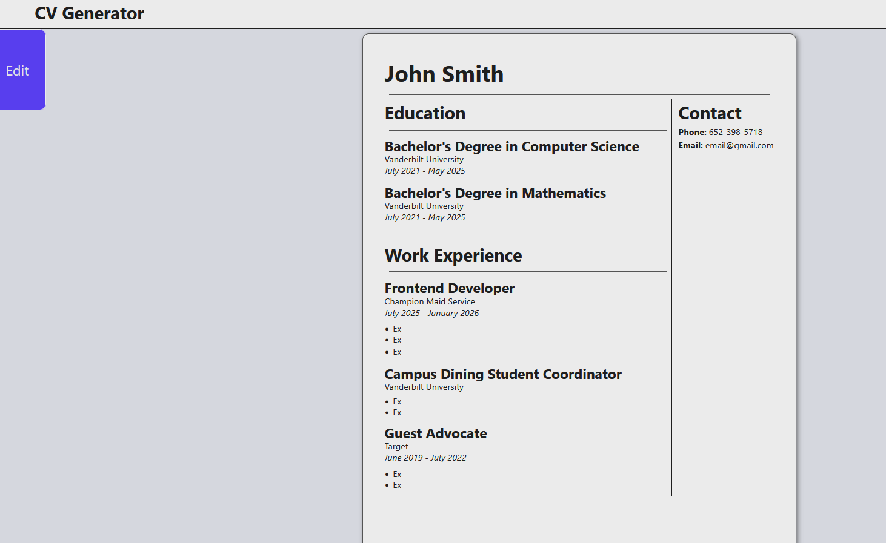
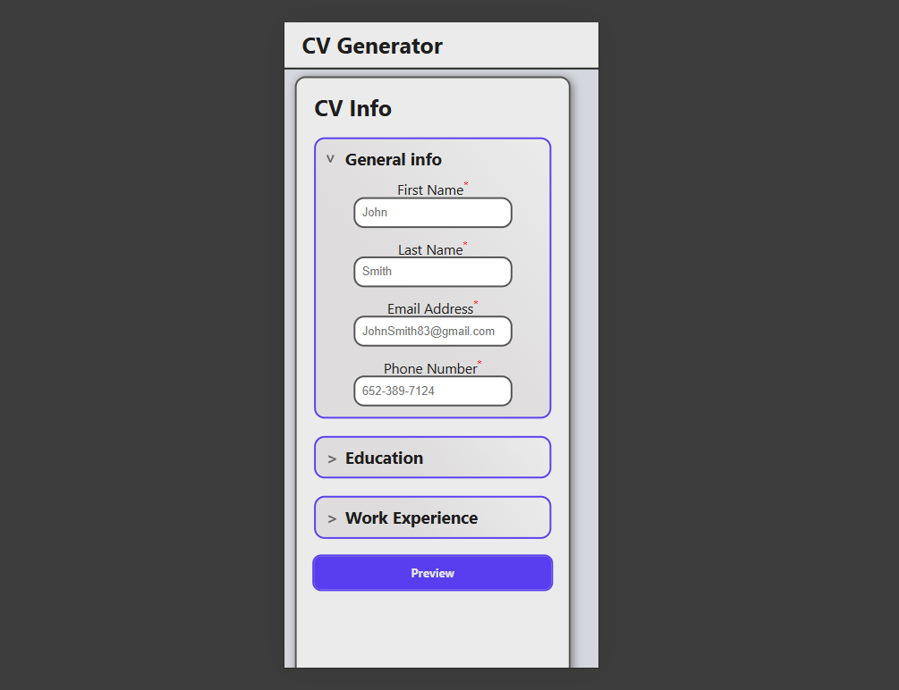

# CV Generator

    

## Table of Contents

- [About](#about)
- [Installation / Website Demo](#installation--website-demo)
- [Features](#features)
    - [PDF Exporting](#pdf-exporting)
    - [Responsive UI Animations](#responsive-ui-animations)
- [Tech Stack](#tech-stack)
- [Credit](#credit)

## About

The CV Generator is the the first React + TypeScript + Vite project I've created. This project was created as a benchmark of my self-directed React study to emphasize fundamental React functionalities of reusable component design, managing state between components, maintaining responsive, mobile-friendly UI design, and practicing industry-standard type-safety with React in TypeScript. The site allows users to input applicable hiring information, such as contact info, education info, and work experience information. The site formats this information into a CV-style layout, and users can preview, download, and print their generated CV.

## Installation / Website Demo

The website is hosted on CloudFlare, and can be accessed below:

[CV Generator](https://cv-application-18c.pages.dev)

Otherwise, the project's functionality can be tested through the following steps:

1. Download the repository.
2. Extract the repository.
3. Open the folder in VSCode, and run `npm install`.
4. Then, run `npm run dev`.
5. Locate the `http://localhost:5173/` output in the terminal.
6. Hold <kbd>Ctrl</kbd> and click on `http://localhost:5173/`, and the hosted deployment version will open.

## Features

### PDF Exporting

A generated resume isn't any good if you can't download it. The CV Generator supports the exporting of generated resumes via PDF download, or print using the react-to-print library. The exported PDF includes proper indentation, and page margin formatting to make the resume look clean and professional. Users can input general info, education info, and work experience, and all entered information will be logically formatted into a comprehensible structure.

### Responsive UI Animations

The CV Generator has stylish transitions that bring life to the page. The layout is responsive to users of any screen size, and adjusts itself to provide the best user experience for the device.

## Tech Stack

- **React** - Underlying framework for web components.
- **TypeScript** - Component logic, data storage, and state management.
- **SCSS** - Used to develop modular CSS rules to easily maintain site aesthetic.
- **Vite** - For project creation and bundling.

## Credit

SVGs used in this project were provided by [SVGRepo](https://www.svgrepo.com).

### Enjoy! :white_check_mark:

[Back to Top](#table-of-contents)
